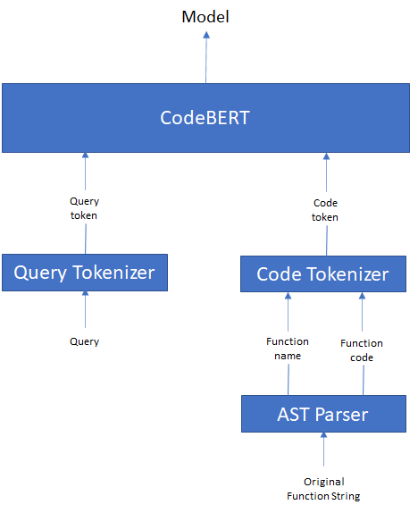
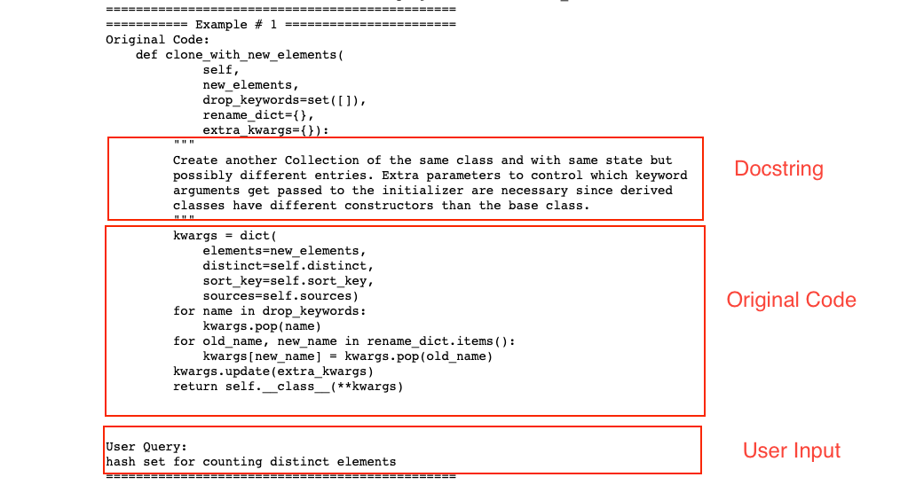

> # Semantic Code Search - CS224N Course Project

This repo is part of our CS224N course project which tries to implement semantic code search for CodeSearchNet Corpus. This is built on top of CodeXGLUE project which is forked into our project (./CodeXGLUE). All of our changes are contained only in ./dataset direcory in the repo.

[Project Report](report/CS224n_Project_Report.pdf)

# Architecture
<p align="center">
  
</p>

In this project we are using HuggingFace's implementation of pre-trained [CodeBERT](https://arxiv.org/pdf/2002.08155.pdf) model. And our approaches are mostly focussing on how to improve the performance of this model. During our project we tried mutliple experiments, but found that including the human feedback query strings, greatly improves the poerformance.

# Dataset

We took the User annotated queries from [CodeSearchNetChallenge](https://arxiv.org/pdf/1909.09436.pdf) and created our own dataset from that based on the format specified by [CodeXGLUE](https://github.com/microsoft/CodeXGLUE/tree/main). To recreate the dataset, you need to follow the setup in dataset directory. But to get started with running the Semantic Code Search, you can probably use the preprocessed dataset. 

### Data Preprocess

```shell
#clone this repository
https://github.com/dinesh-rt/cs224n-project.git
cd cs224n-project
#install conda environment
conda env create -f local_env.yml
cd dataset
#get preprocessed data from S3 cloud
wget https://semanticcodesearch.s3.us-west-2.amazonaws.com/query_dataset.zip
#unzip
unzip query_dataset.zip
```

### Data Format
After preprocessing dataset, you can obtain three .jsonl files, i.e. train.jsonl, valid.jsonl, test.jsonl

For each file, each line in the uncompressed file represents one function.  One row is illustrated below.

  - **repo:** the owner/repo
  - **path:** the full path to the original file
  - **func_name:** the function or method name
  - **original_string:** the raw string before tokenization or parsing
  - **language:** the programming language
  - **code/function:** the part of the `original_string` that is code
  - **code_tokens/function_tokens:** tokenized version of `code`
  - **docstring:** the top-level comment or docstring, if it exists in the original string
  - **docstring_tokens:** tokenized version of `docstring`
  - **url:** the url for the example (identify natural language)
  - **idx**: the index of code (identify code)

This format is proposed by CodeSearchNet Corpus, and this text is used from [CodeXGLUE](https://github.com/microsoft/CodeXGLUE/tree/main)

<p align="center">
  
</p>

### Data Statistics

Data statistics of the dataset are shown in the below table:

|       | #Examples |
| ----- | :-------: |
| Train |    356    |
| Dev   |    83     |
| Test  |    83     |

Details on all different types of data used in this project can be found in [this notebook](demos/code_search_datset.ipynb).

## Pipeline-CodeBERT

Since we use the CodeBERT model and the associated scripts from [CodeXGLUE](./CodeXGLUE/Text-Code/NL-code-search-Adv/), please follow the fine-tuning and evaluation scripts in that README.md.


## Result

The results on the test set are shown as below:

| Method   |     MRR    |
| -------- | :--------: |
| Approach 1  |   38.81  |
| Approach 2  | **43.35** |
| Approach 3  |  37.88  |

Details of these approaches and finer details can be found in the report link above.

## Demo
We have included some sample python notebooks in [Demos](demos/) directory. 


